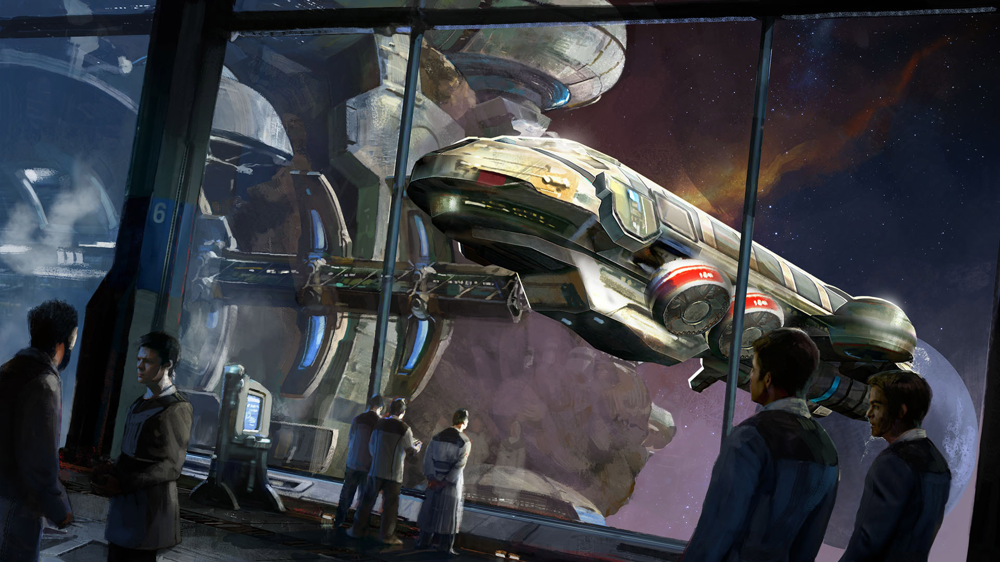
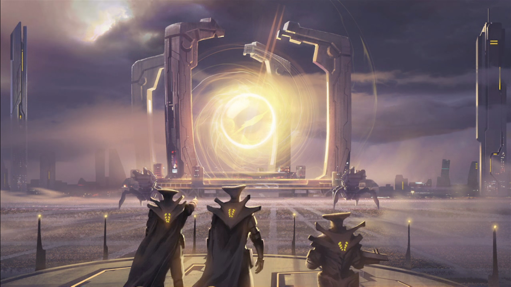
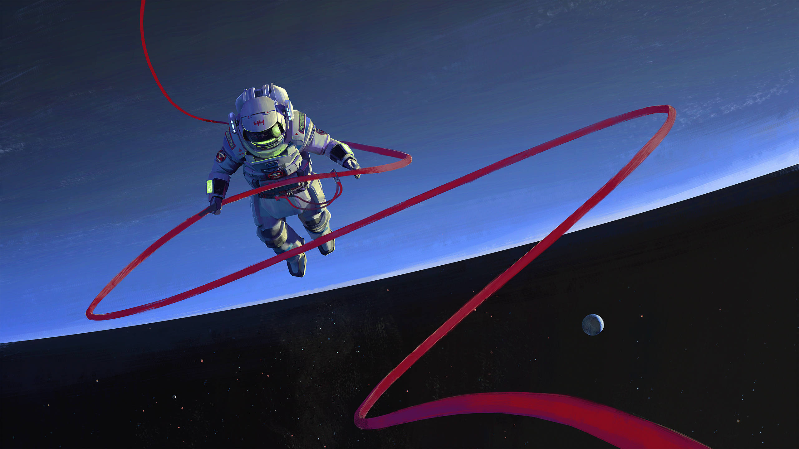
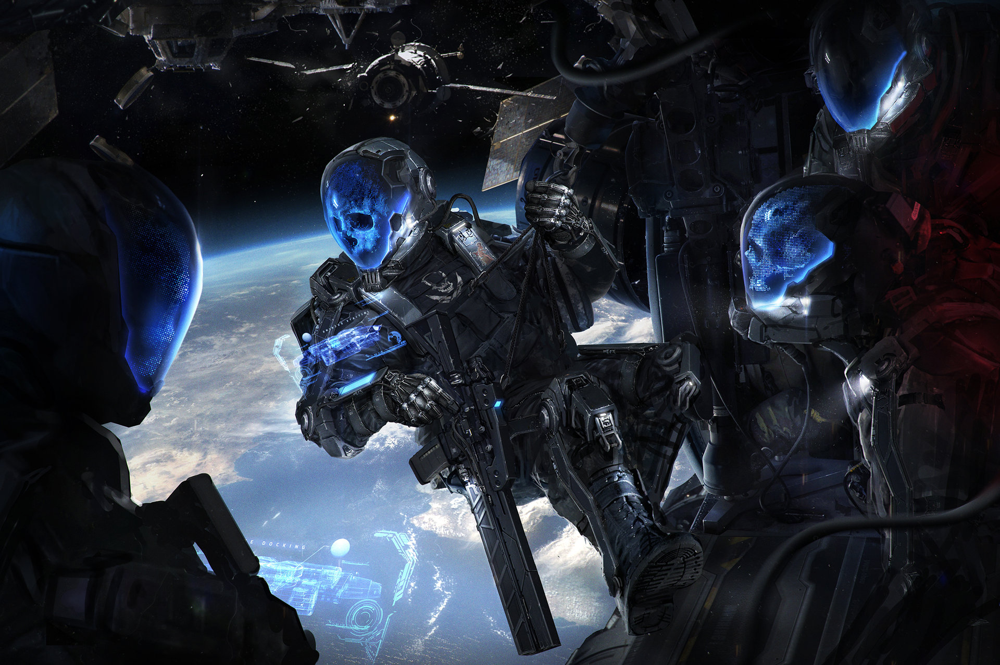

<h1>Frakcje</h1>

<h2>Hanza</h2>

Opis

<h2>Katedra</h2>

Muszą zacząć z wykupionym Sprzęgiem

<h2>Dzieci Gagarina</h2>

Opis

<h2>Wolne Kompanie</h2>

Musisz wydać co najmniej połowę dostępnych punktów wolnych na umiejętności związane z walką albo sprawnością fizyczną

~~<h2>Pochodzenie [in progress] </h2>~~

~~**Na razie nie używamy pochodzenia**~~

~~**Dzieci Gagarina**: Wykupiony Pilotaż~~

~~**Hanza**: Charakter +1, Intuicja +1~~

~~**Katedra**: Transhumaniści, którzy wierzą, że przyszłość ludzkości leży w zespoleniu z maszyną. Muszą wybrać **Sprzęg**. Elektronika +1, Informatyka +1~~

~~*Weteran**:~~

~~<h2>Tworzenie Postaci</h2>~~
