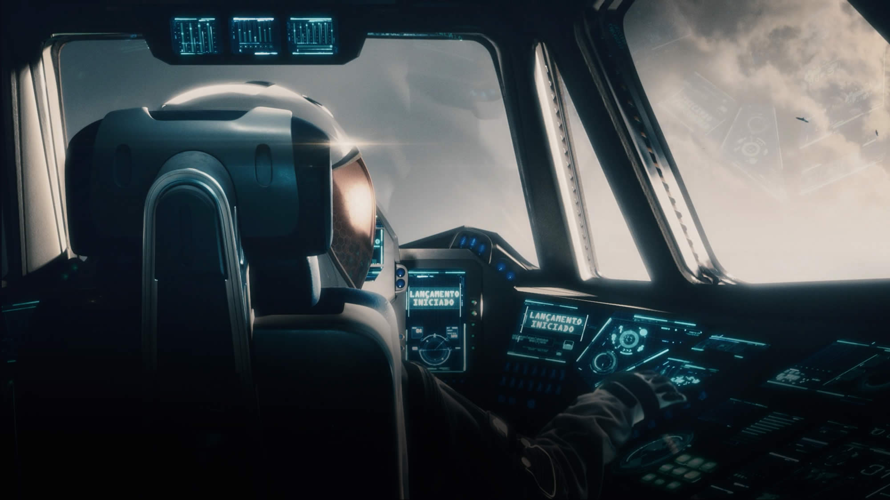

  

    <h2>Hanza</h2>
  

  

  Opis

    

    <h2>Katedra</h2>
  

Muszą zacząć z wykupionym Sprzęgiem

  

  

    <h2>Dzieci Gagarina</h2>
  

    

    <h2>Wolne Kompanie</h2>
  

Musisz wydać co najmniej połowę dostępnych punktów wolnych na umiejętności związane z walką albo sprawnością fizyczną

